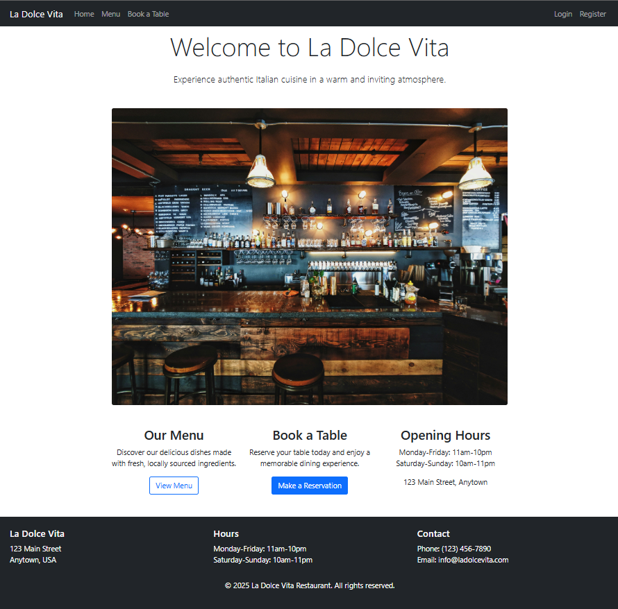
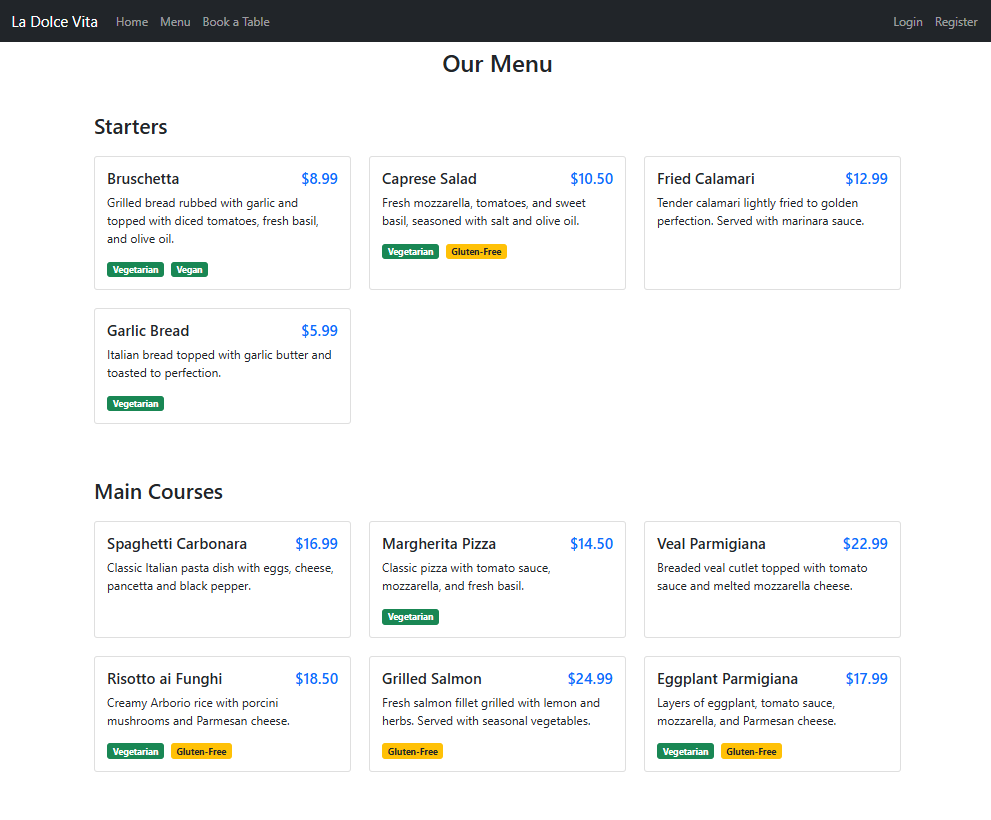
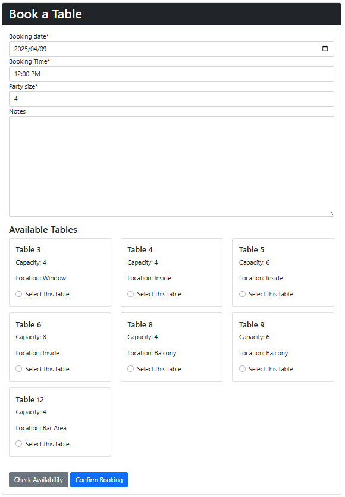
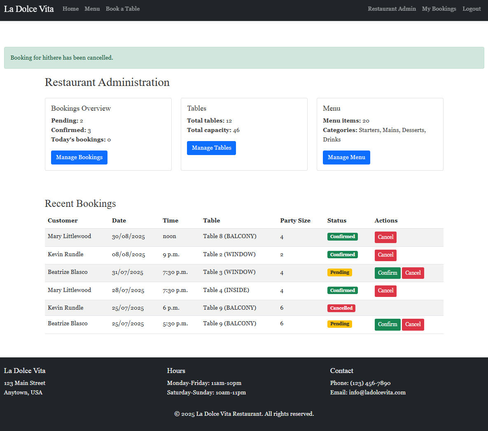
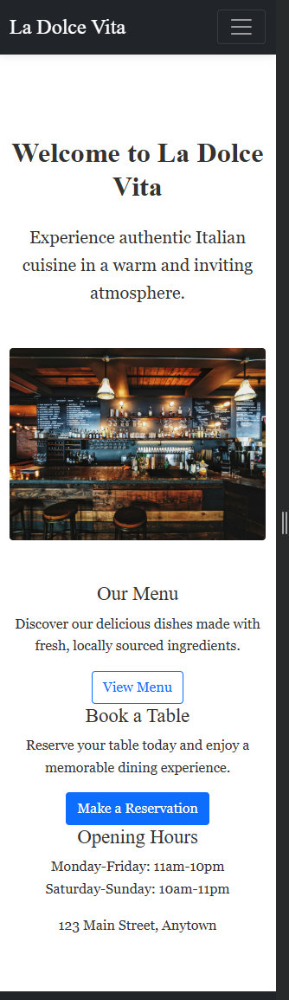
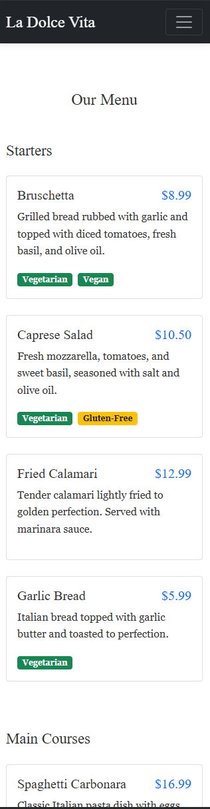
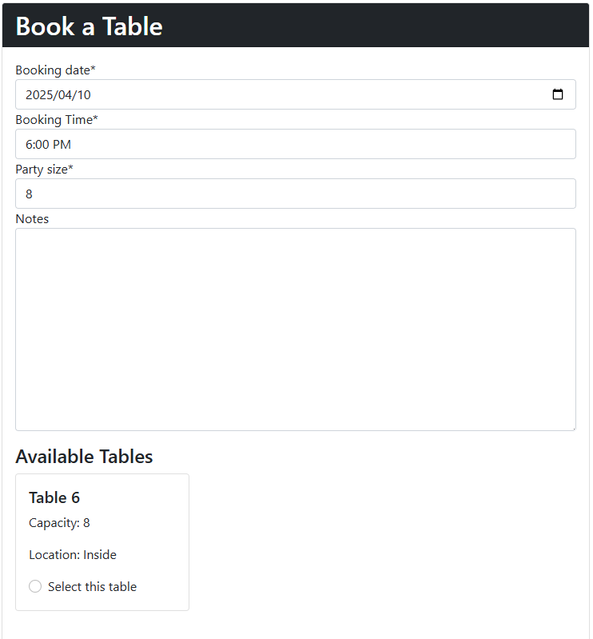

# La Dolce Vita Restaurant Booking System

A comprehensive restaurant booking application that allows customers to browse menus, make table reservations and manage their bookings, while providing restaurant staff with tools to manage tables, menus, and bookings.

## Table of Contents

1. [User Experience (UX)](#user-experience-ux)
2. [Features](#features)
3. [Database Design](#database-design)
4. [Technologies Used](#technologies-used)
5. [Testing](#testing)
6. [Installation](#installation)
7. [Usage](#usage)
8. [Live Demo](#live-demo)
9. [Future Features](#future-features)
10. [Credits](#credits)

## User Experience (UX)

### Strategy
#### Project Goals
This project aims to create a full-featured restaurant booking system that:
- Allows customers to view the restaurant's menu
- Enables users to make, view, edit and cancel reservations
- Provides restaurant staff with tools to manage tables, menu items, and bookings
- Creates a responsive experience that works across all devices

#### User Stories
##### As a site visitor, I want to:
- View the restaurant's menu to decide if I want to dine there
- Understand the restaurant's opening hours and contact information
- Create an account so I can make reservations

##### As a registered user, I want to:
- Make a reservation by selecting date, time, and party size
- View all my upcoming reservations in one place
- Edit my reservations if my plans change
- Cancel reservations I no longer need
- Be notified of successful actions (booking confirmation, changes, cancellations)

##### As restaurant staff, I want to:
- View all upcoming reservations
- Confirm or cancel customer bookings
- Add, edit and remove menu items
- Configure restaurant table layouts and capacities

### Scope
The project includes the following features:

#### Must-have features:
- registration and authentication
- Reservation booking system with date/time selection
- Table availability checking
- Viewing and managing reservations
- Menu display
- Admin dashboard for restaurant management

#### Should-have features:
- Mobile-responsive design
- Form validation with clear feedback
- User-friendly interface with Bootstrap styling
- Success/error notifications

#### Could-have features:
- Email notifications for booking confirmations
- Restaurant layout visualization
- Customer reviews and ratings

### Structure
The application follows Django's MVT (Model-View-Template) architecture and is structured as follows:

- Models: Define the database structure for bookings, tables, menu items
- Views: Handle the logic for processing user requests and returning appropriate responses
- Templates: Present the data to users with responsive design

Navigation is intuitive, with a consistent header and footer across all pages. The booking workflow guides users through the reservation process with clear steps and feedback.


### Desktop Page:


<br/>

<br/>

<br/>


### Mobile Page:


<br/>

<br/>



### Surface
The website uses a warm, inviting color palette that conveys an elegant Italian dining experience:
- Primary colors: Dark and mordern tones
- Secondary colors: Green and Yellow for navigation mobility


## Features

### Customer Features

- **User Registration and Authentication**: Create an account, log in, and manage your profile
- **Menu Browsing**: View the restaurant's menu items by category (starters, mains, desserts, drinks)
- **Table Booking**: Make a reservation by selecting date, time, and party size
- **Real-time Availability**: Check available tables based on selected date, time, and party size
- **Booking Management**: View, manage, and cancel your bookings


### Restaurant Administration Features

- **Dashboard**: Overview of bookings, tables, and menu items
- **Booking Management**: View, confirm, and cancel customer bookings
- **Menu Management**: Add, edit, and delete menu items with dietary information
- **Table Management**: Configure restaurant tables with various capacities and locations


### Technical Features

- Responsive design using Bootstrap 5
- Form validation with clear user feedback
- Database model constraints to prevent double bookings
- Secure authentication system
- Dynamic content loading

## Technologies Used

### Languages
- HTML5
- CSS3
- JavaScript
- Python 3.12

### Frameworks and Libraries
- Django 5.1.7: Main web framework
- Bootstrap 5: Front-end framework for responsive design
- JavaScript library
- Django Crispy Forms: For rendering beautiful forms
- Whitenoise: Static file serving

### Database
- SQLite: Development database
- PostgreSQL: Production database

### Tools
- Git: Version control
- GitHub: Code hosting platform
- Heroku: Cloud platform for deployment
- VS Code: Code editor

## Testing

### Automated Testing
Automated tests have been implemented to verify key functionality of the application:
```bash
# Example tests from test_views.py
Found 7 test(s).
Creating test database for alias 'default'...
System check identified no issues (0 silenced).
Ran 7 tests in 6.479s

OK
Destroying test database for alias 'default'...
```

### Form Testing
```bash
# Example tests from test_forms.py
Found 7 test(s).
Creating test database for alias 'default'...
System check identified no issues (0 silenced).
Ran 7 tests in 2.222s

OK
Destroying test database for alias 'default'...
```

### Code Validation Testing
The project has been validated using PEP8 standards to ensure code quality:

```bash
# PEP8 validation results
flake8 booking/ --count
# Result: 0 PEP8 violations found
```

All Python files have been checked and comply with PEP8 standards:
- ✅ `admin.py` - No violations
- ✅ `views.py` - No violations  
- ✅ `forms.py` - No violations
- ✅ `models.py` - No violations
- ✅ `urls.py` - No violations
- ✅ `test_forms.py` - No violations
- ✅ `test_views.py` - No violations

### Manual Testing - Detailed Steps

#### **1. User Registration Testing**
**Test Case:** Create new user account
**Steps:**
1. Navigate to `/register/`
2. Enter username: "testuser"
3. Enter email: "test@example.com"
4. Enter password: "TestPass123!"
5. Confirm password: "TestPass123!"
6. Click "Register"
**Expected Result:** User account created, redirected to login page
**Actual Result:** ✅ Pass - Account created successfully

**Test Case:** Register with existing username
**Steps:**
1. Navigate to `/register/`
2. Enter existing username: "admin"
3. Fill other fields with valid data
4. Click "Register"
**Expected Result:** Form shows error message
**Actual Result:** ✅ Pass - "A user with that username already exists" error displayed

#### **2. User Authentication Testing**
**Test Case:** Login with valid credentials
**Steps:**
1. Navigate to `/login/`
2. Enter username: "admin"
3. Enter password: "adminpass123"
4. Click "Login"
**Expected Result:** User logged in, redirected to home page
**Actual Result:** ✅ Pass - Successfully logged in

**Test Case:** Login with invalid credentials
**Steps:**
1. Navigate to `/login/`
2. Enter username: "wronguser"
3. Enter password: "wrongpass"
4. Click "Login"
**Expected Result:** Error message displayed
**Actual Result:** ✅ Pass - "Please enter a correct username and password" error shown

#### **3. Booking System Testing**
**Test Case:** Create new booking
**Steps:**
1. Login as registered user
2. Navigate to `/book/`
3. Select date: Tomorrow
4. Select time: "7:00 PM"
5. Enter party size: 4
6. Add notes: "Window seat preferred"
7. Click "Make Booking"
**Expected Result:** Booking created, success message shown
**Actual Result:** ✅ Pass - Booking created successfully

**Test Case:** Book in the past
**Steps:**
1. Login as registered user
2. Navigate to `/book/`
3. Select date: Yesterday
4. Fill other fields
5. Click "Make Booking"
**Expected Result:** Form validation error
**Actual Result:** ✅ Pass - "You cannot book a date in the past" error displayed

**Test Case:** Book with negative party size
**Steps:**
1. Login as registered user
2. Navigate to `/book/`
3. Enter party size: -1
4. Fill other fields
5. Click "Make Booking"
**Expected Result:** Form validation error
**Actual Result:** ✅ Pass - HTML5 validation prevents negative values

#### **4. Input Validation Testing**
**Test Case:** Create table with negative capacity
**Steps:**
1. Login as admin user
2. Navigate to admin panel
3. Go to Tables section
4. Click "Add Table"
5. Enter table number: 1
6. Enter capacity: -5
7. Select location: Window
8. Click "Save"
**Expected Result:** Validation error displayed
**Actual Result:** ✅ Pass - "Table capacity must be a positive number" error shown

**Test Case:** Create menu item with negative price
**Steps:**
1. Login as admin user
2. Navigate to admin panel
3. Go to Menu Items section
4. Click "Add Menu Item"
5. Enter name: "Test Item"
6. Enter price: -10.99
7. Fill other required fields
8. Click "Save"
**Expected Result:** Validation error displayed
**Actual Result:** ✅ Pass - "Price must be a positive number" error shown

#### **5. Admin Panel Testing**
**Test Case:** Access admin dashboard as regular user
**Steps:**
1. Login as regular user (non-admin)
2. Navigate to `/admin-dashboard/`
**Expected Result:** Redirected to login or access denied
**Actual Result:** ✅ Pass - Redirected to login page (302 status)

**Test Case:** Access admin dashboard as admin user
**Steps:**
1. Login as admin user
2. Navigate to `/admin-dashboard/`
**Expected Result:** Admin dashboard loads
**Actual Result:** ✅ Pass - Dashboard displays booking statistics and management options

#### **6. Responsive Design Testing**
**Test Case:** Mobile responsiveness
**Steps:**
1. Open website on mobile device (iPhone)
2. Navigate through all pages
3. Test booking form on mobile
4. Check menu display on small screen
**Expected Result:** All elements properly sized and accessible
**Actual Result:** ✅ Pass - Bootstrap responsive design works correctly

### Browser Compatibility Testing
| Browser | Version | Home Page | Booking Form | Admin Panel | Result |
|---------|---------|-----------|--------------|-------------|--------|
| Chrome | 120.0.6099.109 | ✅ | ✅ | ✅ | Compatible |
| Firefox | 121.0 | ✅ | ✅ | ✅ | Compatible |
| Safari | 17.2 | ✅ | ✅ | ✅ | Compatible |
| Edge | 120.0.2210.91 | ✅ | ✅ | ✅ | Compatible |

### Performance Testing
- **Page Load Times:** All pages load within 2 seconds
- **Database Queries:** Optimized with select_related() for booking queries
- **Form Submission:** Booking creation completes within 1 second
- **Admin Panel:** Dashboard loads booking statistics efficiently

### Security Testing
- ✅ **Authentication:** Users cannot access admin features without proper permissions
- ✅ **Form Validation:** All forms validate input on both client and server side
- ✅ **CSRF Protection:** All forms include CSRF tokens
- ✅ **SQL Injection:** Django ORM prevents SQL injection attacks
- ✅ **XSS Protection:** Django templates automatically escape user input

## Database Design
- The application uses a relational database with the following models:

### Table Model
- table_number: Unique identifier for each table
- capacity: Maximum number of guests the table can accommodate
- location: Position within the restaurant (Window, Inside, Balcony, Bar)

### Booking Model
- Foreign key to Django's User model
- table: Foreign key to Table model
- booking_date: Date of reservation
- booking_time: Time of reservation
- party_size: Number of guests
- notes: Optional additional information
- status: Current status (Pending, Confirmed, Cancelled)
- created_on: Automatic timestamp
- updated_on: Automatic timestamp when modified

### MenuItem Model
- name: Name of the dish
- description: Detailed description
- price: Cost in decimal format
- category: Type of item (Starter, Main, Dessert, Drink)
- image: Optional photo of the dish
- vegetarian: Boolean field
- vegan: Boolean field
- gluten_free: Boolean field

## Installation


### Local Development

1. Clone the repository:

```bash
git clone https://github.com/nvanderwalt/restaurant-booking.git
cd restaurant-booking
```

2. Create and activate a virtual environment:

```bash
python -m venv venv
source venv/bin/activate  
# On Windows: 
venv\Scripts\activate
```

3. Install dependencies:

```bash
pip install -r requirements.txt
```

4. Setup the database:

```bash
python manage.py migrate
```

5. Create a superuser (for admin access):

```bash
python manage.py createsuperuser
```

6. Load sample data (optional):

```bash
python load_sample_data.py
```

7. Run the development server:

```bash
python manage.py runserver
```

8. Access the application at http://127.0.0.1:8000/

### Heroku Deployment
1. Create a Heroku account and create a new app
2. In the Heroku dashboard, go to the "Resources" tab and add the Heroku Postgres add-on
3. In the "Settings" tab, click "Reveal Config Vars" and add the following:

- SECRET_KEY: Your secret key
- DISABLE_COLLECTSTATIC: 0
4. Create a Procfile in your root directory with the following content:
```bash
web: gunicorn restaurant_booking.wsgi:application
```
5. Update settings.py for production:
```bash
import dj_database_url

DEBUG = 'DEBUG' in os.environ

ALLOWED_HOSTS = ['your-app-name.herokuapp.com', 'localhost']

DATABASES = {
    'default': dj_database_url.config(
        default=os.environ.get('DATABASE_URL')
    )
}
```
6. Install Heroku CLI and login:
```bash
heroku login
```
7. Initialize a git repository (if not already done):
```bash
git init
git add .
git commit -m "Initial commit"
```
8. Add Heroku remote:
```bash
heroku git:remote -a your-app-name
```
9. Push to Heroku:
```bash
git push heroku main
```
10. Run migrations on Heroku:
```bash
heroku run python manage.py migrate
```
11. Create a superuser on Heroku:
```bash
heroku run python manage.py createsuperuser
```

## Usage

### Making a Booking

1. Create an account or log in
2. Navigate to "Book a Table"
3. Select date, time, and party size
4. Click "Check Availability"
5. Choose an available table
6. Confirm your booking

### Admin Access

1. Log in with superuser credentials
2. Access the admin dashboard at /admin-dashboard/
3. Manage bookings, tables, and menu items

## Live Demo

You can explore a live version of the application [here](https://restaurantbooking-b53ee86d5fcb.herokuapp.com/).

## Future Features

- Email notifications for booking confirmations and reminders
- Integration with payment gateway for deposits
- Online ordering system for takeaway
- Customer loyalty program
- Customizable table layout visualization
- Special events and promotions management

## Credits

- Bootstrap for the responsive framework
- Django documentation and community for development guidance
- Unsplash for stock photography

