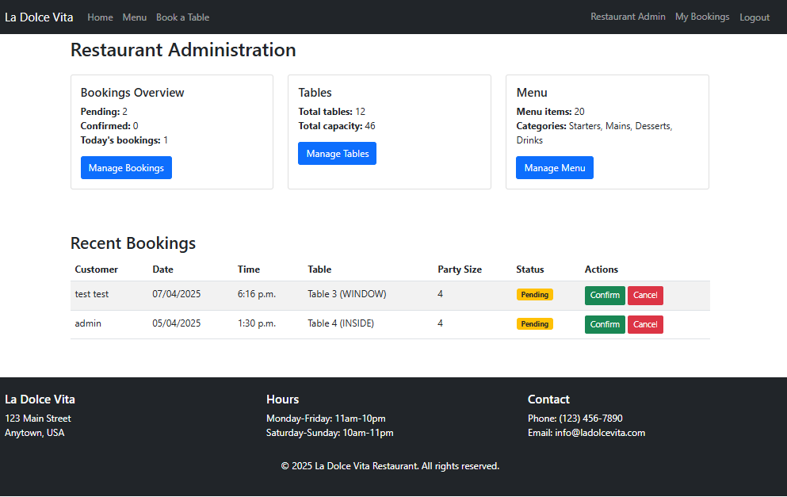

# La Dolce Vita Restaurant Booking System

A Django-based web application for managing restaurant bookings and menus.

## Table of Contents

1. [Overview](#overview)
2. [Features](#features)
3. [Technologies Used](#technologies-used)
4. [Installation](#installation)
5. [Usage](#usage)
6. [Live Demo](#live-demo)
7. [Future Features](#future-features)
8. [Credits](#credits)

## Overview

La Dolce Vita is a full-featured restaurant booking system that allows customers to view menus, make reservations, and manage their bookings. Restaurant staff can manage tables, menu items, and confirm/cancel bookings through an admin interface.

The application features a responsive design that works across desktop and mobile devices, with real-time availability checking for table bookings.

## Features

### Customer Features

- **User Registration and Authentication**: Create an account, log in, and manage your profile
- **Menu Browsing**: View the restaurant's menu items by category (starters, mains, desserts, drinks)
- **Table Booking**: Make a reservation by selecting date, time, and party size
- **Real-time Availability**: Check available tables based on selected date, time, and party size
- **Booking Management**: View, manage, and cancel your bookings


### Restaurant Administration Features

- **Dashboard**: Overview of bookings, tables, and menu items
- **Booking Management**: View, confirm, and cancel customer bookings
- **Menu Management**: Add, edit, and delete menu items with dietary information
- **Table Management**: Configure restaurant tables with various capacities and locations



### Technical Features

- Responsive design using Bootstrap 5
- Form validation with clear user feedback
- Database model constraints to prevent double bookings
- Secure authentication system
- Dynamic content loading

## Technologies Used

- **Backend**: Django 5.1.7
- **Frontend**: HTML, CSS, JavaScript, Bootstrap 5
- **Database**: PostgreSQL (production), SQLite (development)
- **Deployment**: Heroku
- **Other**: Whitenoise for static files, Pillow for image processing

## Installation

### Prerequisites

- Python 3.12
- pip (Python package manager)
- Git

### Setup

1. Clone the repository:

```bash
git clone https://github.com/nvanderwalt/restaurant-booking.git
cd restaurant-booking
```

2. Create and activate a virtual environment:

```bash
python -m venv venv
source venv/bin/activate  
# On Windows: 
venv\Scripts\activate
```

3. Install dependencies:

```bash
pip install -r requirements.txt
```

4. Setup the database:

```bash
python manage.py migrate
```

5. Create a superuser (for admin access):

```bash
python manage.py createsuperuser
```

6. Load sample data (optional):

```bash
python load_sample_data.py
```

7. Run the development server:

```bash
python manage.py runserver
```

8. Access the application at http://127.0.0.1:8000/


## Usage

### Making a Booking

1. Create an account or log in
2. Navigate to "Book a Table"
3. Select date, time, and party size
4. Click "Check Availability"
5. Choose an available table
6. Confirm your booking

### Admin Access

1. Log in with superuser credentials
2. Access the admin dashboard at /admin-dashboard/
3. Manage bookings, tables, and menu items

## Live Demo

You can explore a live version of the application [here](https://restaurantbooking-b53ee86d5fcb.herokuapp.com/).

## Future Features

- Email notifications for booking confirmations and reminders
- Integration with payment gateway for deposits
- Online ordering system for takeaway
- Customer loyalty program
- Customizable table layout visualization
- Special events and promotions management

## Credits

- Bootstrap for the responsive framework
- Django documentation and community for development guidance
- Unsplash for stock photography

