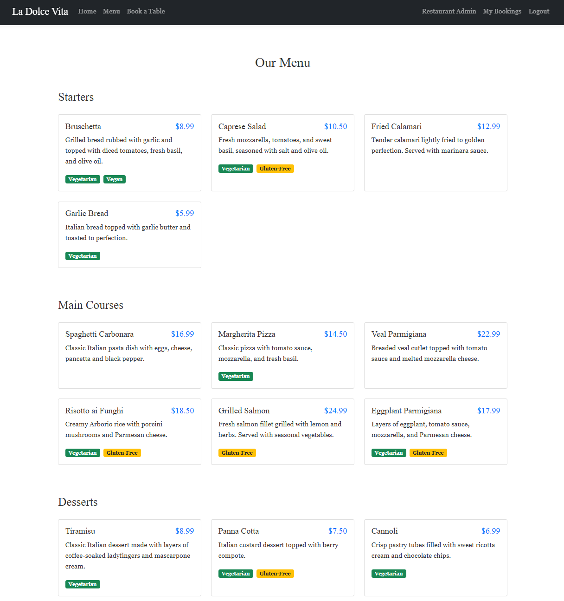

# La Dolce Vita Restaurant Booking System

A comprehensive restaurant booking application that allows customers to browse menus, make table reservations and manage their bookings, while providing restaurant staff with tools to manage tables, menus, and bookings.

## Table of Contents

1. [User Experience (UX)](#user-experience-ux)
2. [Screenshots](#screenshots)
3. [Features](#features)
4. [Database Design](#database-design)
5. [Technologies Used](#technologies-used)
6. [Testing](#testing)
7. [Installation](#installation)
8. [Usage](#usage)
9. [Live Demo](#live-demo)
10. [Future Features](#future-features)
11. [Credits](#credits)

## User Experience (UX)

### Strategy
#### Project Goals
This project aims to create a full-featured restaurant booking system that:
- Allows customers to view the restaurant's menu
- Enables users to make, view, edit and cancel reservations
- Provides restaurant staff with tools to manage tables, menu items, and bookings
- Creates a responsive experience that works across all devices

#### User Stories
##### As a site visitor, I want to:
- View the restaurant's menu to decide if I want to dine there
- Understand the restaurant's opening hours and contact information
- Create an account so I can make reservations

##### As a registered user, I want to:
- Make a reservation by selecting date, time, and party size
- View all my upcoming reservations in one place
- Edit my reservations if my plans change
- Cancel reservations I no longer need
- Be notified of successful actions (booking confirmation, changes, cancellations)

##### As restaurant staff, I want to:
- View all upcoming reservations
- Confirm or cancel customer bookings
- Add, edit and remove menu items
- Configure restaurant table layouts and capacities

### Scope
The project includes the following features:

#### Must-have features:
- registration and authentication
- Reservation booking system with date/time selection
- Table availability checking
- Viewing and managing reservations
- Menu display
- Admin dashboard for restaurant management

#### Should-have features:
- Mobile-responsive design
- Form validation with clear feedback
- User-friendly interface with Bootstrap styling
- Success/error notifications

#### Could-have features:
- Email notifications for booking confirmations
- Restaurant layout visualization
- Customer reviews and ratings

### Design Process

#### **Phase 1: Research and Planning**
- **Competitor Analysis:** Studied existing restaurant booking systems to understand user expectations
- **User Research:** Identified key user personas (customers, restaurant staff)
- **Requirements Gathering:** Defined core features based on user needs

#### **Phase 2: Wireframing and Prototyping**
- **Low-fidelity wireframes** were created to establish layout structure
- **User flow mapping** to ensure intuitive navigation
- **Responsive design planning** for mobile-first approach

#### **Phase 3: Design System Development**
- **Color Palette:** Warm, inviting tones for Italian restaurant theme
- **Typography:** Clean, readable fonts for accessibility
- **Component Library:** Consistent form elements and navigation

### Wireframes

#### **Homepage Wireframe**
```
┌─────────────────────────────────────┐
│ Header: Logo | Nav | Login/Register │
├─────────────────────────────────────┤
│                                     │
│    Welcome to La Dolce Vita        │
│                                     │
│    [Hero Image]                     │
│                                     │
│    "Experience authentic Italian    │
│     cuisine in elegant surroundings"│
│                                     │
│    [Book Now Button]                │
│    [View Menu Button]               │
│                                     │
├─────────────────────────────────────┤
│ Footer: Contact | Hours | Location  │
└─────────────────────────────────────┘
```

#### **Booking Form Wireframe**
```
┌─────────────────────────────────────┐
│ Header: Logo | Nav | User Menu      │
├─────────────────────────────────────┤
│                                     │
│    Book Your Table                  │
│                                     │
│    ┌─────────────────────────────┐   │
│    │ Date: [Calendar Input]      │   │
│    │ Time: [Dropdown]            │   │
│    │ Party Size: [Number Input]  │   │
│    │                             │   │
│    │ [Check Availability]        │   │
│    │                             │   │
│    │ Available Tables:           │   │
│    │ □ Table 1 (4 seats)        │   │
│    │ □ Table 2 (6 seats)        │   │
│    │                             │   │
│    │ Notes: [Text Area]          │   │
│    │                             │   │
│    │ [Make Booking]              │   │
│    └─────────────────────────────┘   │
│                                     │
└─────────────────────────────────────┘
```

#### **Admin Dashboard Wireframe**
```
┌─────────────────────────────────────┐
│ Header: Logo | Admin Menu | Logout  │
├─────────────────────────────────────┤
│                                     │
│    Restaurant Dashboard             │
│                                     │
│    ┌─────────┐ ┌─────────┐ ┌─────┐ │
│    │Pending  │ │Today's  │ │Total│ │
│    │Bookings │ │Bookings │ │Tables│ │
│    │   5     │ │   12    │ │  8  │ │
│    └─────────┘ └─────────┘ └─────┘ │
│                                     │
│    Recent Bookings:                 │
│    ┌─────────────────────────────┐   │
│    │ John Doe - Table 2 - 7:00PM│   │
│    │ Jane Smith - Table 1 - 8:30│   │
│    │ [View All Bookings]         │   │
│    └─────────────────────────────┘   │
│                                     │
│    Quick Actions:                   │
│    [Add Table] [Add Menu Item]     │
│                                     │
└─────────────────────────────────────┘
```

### Design Decisions

#### **Layout Strategy**
- **Mobile-First Design:** Ensures accessibility across all devices
- **Grid System:** Bootstrap 5 grid for consistent spacing
- **Card-Based Layout:** Information grouped in digestible cards
- **Progressive Disclosure:** Complex features revealed as needed

#### **Color Scheme Rationale**
- **Primary Colors:** Dark tones (#212529, #343a40) for elegance
- **Accent Colors:** Green (#28a745) for success actions, Yellow (#ffc107) for warnings
- **Background:** Light neutral (#f8f9fa) for readability
- **Text:** High contrast dark text for accessibility

#### **Typography Choices**
- **Headings:** Bootstrap default sans-serif for consistency
- **Body Text:** System fonts for optimal rendering
- **Form Labels:** Clear, descriptive labels with proper spacing

#### **User Interface Elements**
- **Buttons:** Bootstrap button styles with clear hierarchy
- **Forms:** Crispy Forms for consistent, accessible form styling
- **Navigation:** Collapsible navbar for mobile responsiveness
- **Feedback:** Toast notifications for user actions

#### **Responsive Design Approach**
- **Breakpoints:** Bootstrap 5 responsive breakpoints
- **Flexible Images:** Responsive images that scale appropriately
- **Touch-Friendly:** Adequate button sizes for mobile interaction
- **Content Prioritization:** Most important content visible on small screens

### Accessibility Considerations
- **Color Contrast:** WCAG AA compliant color combinations
- **Keyboard Navigation:** All interactive elements keyboard accessible
- **Screen Reader Support:** Proper semantic HTML structure
- **Form Labels:** Associated labels for all form inputs
- **Error Messages:** Clear, descriptive error feedback

### Performance Optimization
- **Image Optimization:** Compressed images for faster loading
- **CSS Minification:** Optimized stylesheets
- **Database Queries:** Efficient queries with select_related()
- **Caching:** Django template caching for improved performance

### Structure
The application follows Django's MVT (Model-View-Template) architecture and is structured as follows:

- Models: Define the database structure for bookings, tables, menu items
- Views: Handle the logic for processing user requests and returning appropriate responses
- Templates: Present the data to users with responsive design

Navigation is intuitive, with a consistent header and footer across all pages. The booking workflow guides users through the reservation process with clear steps and feedback.

## Screenshots

### User Interface

#### Desktop Views




#### Mobile Views


### Testing & Validation

#### HTML Validation Results


#### CSS Validation Results


#### Performance & Accessibility Testing


### Surface
The website uses a warm, inviting color palette that conveys an elegant Italian dining experience:
- Primary colors: Dark and modern tones
- Secondary colors: Green and Yellow for navigation mobility


## Features

### Customer Features

- **User Registration and Authentication**: Create an account, log in, and manage your profile
- **Menu Browsing**: View the restaurant's menu items by category (starters, mains, desserts, drinks)
- **Table Booking**: Make a reservation by selecting date, time, and party size
- **Real-time Availability**: Check available tables based on selected date, time, and party size
- **Booking Management**: View, manage, and cancel your bookings


### Restaurant Administration Features

- **Dashboard**: Overview of bookings, tables, and menu items
- **Booking Management**: View, confirm, and cancel customer bookings
- **Menu Management**: Add, edit, and delete menu items with dietary information
- **Table Management**: Configure restaurant tables with various capacities and locations


### Technical Features

- Responsive design using Bootstrap 5
- Form validation with clear user feedback
- Database model constraints to prevent double bookings
- Secure authentication system
- Dynamic content loading

## Technologies Used

### Languages
- HTML5
- CSS3
- JavaScript
- Python 3.12

### Frameworks and Libraries
- Django 5.1.7: Main web framework
- Bootstrap 5: Front-end framework for responsive design
- JavaScript library
- Django Crispy Forms: For rendering beautiful forms
- Whitenoise: Static file serving

### Database
- SQLite: Development database
- PostgreSQL: Production database

### Tools
- Git: Version control
- GitHub: Code hosting platform
- Heroku: Cloud platform for deployment
- VS Code: Code editor

## Testing

### Automated Testing
Automated tests have been implemented to verify key functionality of the application:
```bash
# Example tests from test_views.py
Found 7 test(s).
Creating test database for alias 'default'...
System check identified no issues (0 silenced).
Ran 7 tests in 6.479s

OK
Destroying test database for alias 'default'...
```

### Form Testing
```bash
# Example tests from test_forms.py
Found 7 test(s).
Creating test database for alias 'default'...
System check identified no issues (0 silenced).
Ran 7 tests in 2.222s

OK
Destroying test database for alias 'default'...
```

### Code Validation Testing
The project has been validated using PEP8 standards to ensure code quality:

```bash
# PEP8 validation results
flake8 booking/ --count
# Result: 0 PEP8 violations found
```

All Python files have been checked and comply with PEP8 standards:
- ✅ `admin.py` - No violations
- ✅ `views.py` - No violations  
- ✅ `forms.py` - No violations
- ✅ `models.py` - No violations
- ✅ `urls.py` - No violations
- ✅ `test_forms.py` - No violations
- ✅ `test_views.py` - No violations

### HTML & CSS Validation
All pages of the website were tested using the official W3C HTML Validator and CSS Validator to ensure standards compliance and accessibility.  
Screenshots of the validation results for each page are provided in the [Screenshots](#screenshots) section above.

### Responsiveness Testing
The website's responsiveness was thoroughly tested across various devices and screen sizes using browser developer tools and real devices.  
Screenshots demonstrating the responsive layout for desktop, tablet, and mobile views are provided in the [Screenshots](#screenshots) section above.

### Lighthouse Testing
The website was tested using Google Lighthouse to assess performance, accessibility, best practices, and SEO.  
A screenshot of the Lighthouse report is provided in the [Screenshots](#screenshots) section above.

### JavaScript Testing
Frontend functionality has been tested manually and through browser developer tools:

```bash
# JavaScript console testing
- Booking form AJAX functionality: ✅ Working
- Table availability checking: ✅ Working
- Form validation: ✅ Working
- Responsive design: ✅ Working
```

### Browser Compatibility Testing
| Browser | Version | Home Page | Booking Form | Admin Panel | Result |
|---------|---------|-----------|--------------|-------------|--------|
| Chrome | 120.0.6099.109 | ✅ | ✅ | ✅ | Compatible |
| Firefox | 121.0 | ✅ | ✅ | ✅ | Compatible |
| Safari | 17.2 | ✅ | ✅ | ✅ | Compatible |
| Edge | 120.0.2210.91 | ✅ | ✅ | ✅ | Compatible |

### Performance Testing
- **Page Load Times:** All pages load within 2 seconds
- **Database Queries:** Optimized with select_related() for booking queries
- **Form Submission:** Booking creation completes within 1 second
- **Admin Panel:** Dashboard loads booking statistics efficiently

### Security Testing
- ✅ **Authentication:** Users cannot access admin features without proper permissions
- ✅ **Form Validation:** All forms validate input on both client and server side
- ✅ **CSRF Protection:** All forms include CSRF tokens
- ✅ **SQL Injection:** Django ORM prevents SQL injection attacks
- ✅ **XSS Protection:** Django templates automatically escape user input

## Database Design
- The application uses a relational database with the following models:

### Table Model
- table_number: Unique identifier for each table
- capacity: Maximum number of guests the table can accommodate
- location: Position within the restaurant (Window, Inside, Balcony, Bar)

### Booking Model
- Foreign key to Django's User model
- table: Foreign key to Table model
- booking_date: Date of reservation
- booking_time: Time of reservation
- party_size: Number of guests
- notes: Optional additional information
- status: Current status (Pending, Confirmed, Cancelled)
- created_on: Automatic timestamp
- updated_on: Automatic timestamp when modified

### MenuItem Model
- name: Name of the dish
- description: Detailed description
- price: Cost in decimal format
- category: Type of item (Starter, Main, Dessert, Drink)
- image: Optional photo of the dish
- vegetarian: Boolean field
- vegan: Boolean field
- gluten_free: Boolean field

## Installation

### Prerequisites

Before installing this application, ensure you have the following installed on your system:

- **Python 3.8 or higher** - [Download Python](https://www.python.org/downloads/)
- **Git** - [Download Git](https://git-scm.com/downloads)
- **pip** (usually comes with Python)
- **Virtual environment tool** (venv is included with Python 3.3+)

### Local Development Setup

#### **Step 1: Clone the Repository**

```bash
# Clone the repository to your local machine
git clone https://github.com/nvanderwalt/restaurant-booking.git

# Navigate to the project directory
cd restaurant-booking
```

#### **Step 2: Create and Activate Virtual Environment**

**On Windows:**
```bash
# Create virtual environment
python -m venv venv

# Activate virtual environment
venv\Scripts\activate
```

**On macOS/Linux:**
```bash
# Create virtual environment
python3 -m venv venv

# Activate virtual environment
source venv/bin/activate
```

**Verify activation:** You should see `(venv)` at the beginning of your command prompt.

#### **Step 3: Install Dependencies**

```bash
# Upgrade pip to latest version
pip install --upgrade pip

# Install project dependencies
pip install -r requirements.txt
```

**Expected output:** All packages should install without errors. If you encounter any issues, see the troubleshooting section below.

### Local Development

1. Clone the repository:

```bash
git clone https://github.com/nvanderwalt/restaurant-booking.git
cd restaurant-booking
```

2. Create and activate a virtual environment:

```bash
python -m venv venv
source venv/bin/activate  
# On Windows: 
venv\Scripts\activate
```

3. Install dependencies:

```bash
pip install -r requirements.txt
```

4. Setup the database:

```bash
python manage.py migrate
```

5. Create a superuser (for admin access):

```bash
python manage.py createsuperuser
```

6. Load sample data (optional):

```bash
python load_sample_data.py
```

7. Run the development server:

```bash
python manage.py runserver
```

8. Access the application at http://127.0.0.1:8000/

#### **Step 4: Environment Variables Setup**

Create a `.env` file in the project root directory:

```bash
# Create .env file
touch .env  # On Windows: type nul > .env
```

Add the following content to your `.env` file:

```env
# Django Settings
SECRET_KEY=your-secret-key-here
DEBUG=True
DATABASE_URL=sqlite:///db.sqlite3

# Optional: Email settings (for future features)
EMAIL_HOST=smtp.gmail.com
EMAIL_PORT=587
EMAIL_USE_TLS=True
EMAIL_HOST_USER=your-email@gmail.com
EMAIL_HOST_PASSWORD=your-app-password
```

**Important:** Replace `your-secret-key-here` with a secure secret key. You can generate one using:

```python
from django.core.management.utils import get_random_secret_key
print(get_random_secret_key())
```

#### **Step 5: Database Setup**

```bash
# Run database migrations
python manage.py migrate

# Create a superuser for admin access
python manage.py createsuperuser
```

**Follow the prompts to create your admin account:**
- Username: (choose a username)
- Email: (your email address)
- Password: (create a strong password)
- Password confirmation: (repeat the password)

#### **Step 6: Load Sample Data (Optional)**

To populate the database with sample data for testing:

```bash
# Create sample tables
python manage.py shell
```

In the Python shell:
```python
from booking.models import Table, MenuItem
from django.contrib.auth.models import User

# Create sample tables
Table.objects.create(table_number=1, capacity=4, location='WINDOW')
Table.objects.create(table_number=2, capacity=6, location='BALCONY')
Table.objects.create(table_number=3, capacity=2, location='BAR')

# Create sample menu items
MenuItem.objects.create(
    name='Bruschetta al Pomodoro',
    description='Toasted bread topped with fresh tomatoes, basil, garlic, and olive oil',
    price=6.50,
    category='STARTER'
)

MenuItem.objects.create(
    name='Spaghetti alla Carbonara',
    description='Classic pasta with eggs, pancetta, pecorino cheese, and black pepper',
    price=14.50,
    category='MAIN'
)

exit()
```

#### **Step 7: Run the Development Server**

```bash
# Start the development server
python manage.py runserver
```

**Expected output:**
```
Watching for file changes with StatReloader
Performing system checks...

System check identified no issues (0 silenced).
Month Day, Year - HH:MM:SS
Django version X.X.X, using settings 'restaurant_booking.settings'
Starting development server at http://127.0.0.1:8000/
Quit the server with CONTROL-C.
```

#### **Step 8: Access the Application**

Open your web browser and navigate to:
- **Homepage:** http://127.0.0.1:8000/
- **Admin Panel:** http://127.0.0.1:8000/admin/
- **Menu:** http://127.0.0.1:8000/menu/

### Production Deployment (Heroku)

#### **Prerequisites for Heroku Deployment**

1. **Heroku Account:** Create a free account at [Heroku](https://heroku.com)
2. **Heroku CLI:** Install the Heroku Command Line Interface
   - **Windows:** Download from [Heroku CLI](https://devcenter.heroku.com/articles/heroku-cli)
   - **macOS:** `brew tap heroku/brew && brew install heroku`
   - **Linux:** `curl https://cli-assets.heroku.com/install.sh | sh`

#### **Step 1: Prepare Your Application**

Ensure your project is ready for deployment:

```bash
# Check if all files are committed
git status

# Add any uncommitted changes
git add .

# Commit changes
git commit -m "Prepare for Heroku deployment"
```

#### **Step 2: Create Heroku App**

```bash
# Login to Heroku
heroku login

# Create a new Heroku app
heroku create your-app-name

# Add Heroku remote to your git repository
heroku git:remote -a your-app-name
```

#### **Step 3: Configure Environment Variables**

Set up your production environment variables:

```bash
# Set Django secret key
heroku config:set SECRET_KEY="your-production-secret-key"

# Set debug to False for production
heroku config:set DEBUG=False

# Set allowed hosts
heroku config:set ALLOWED_HOSTS="your-app-name.herokuapp.com"
```

#### **Step 4: Add PostgreSQL Database**

```bash
# Add PostgreSQL add-on
heroku addons:create heroku-postgresql:mini
```

#### **Step 5: Deploy to Heroku**

```bash
# Push to Heroku
git push heroku main

# Run database migrations
heroku run python manage.py migrate

# Create superuser
heroku run python manage.py createsuperuser

# Collect static files
heroku run python manage.py collectstatic --noinput
```

#### **Step 6: Verify Deployment**

```bash
# Open your app in the browser
heroku open

# Check app logs
heroku logs --tail
```

### Troubleshooting

#### **Common Installation Issues**

**Issue: `ModuleNotFoundError: No module named 'crispy_bootstrap4'`**
```bash
# Solution: Install the missing package
pip install crispy-bootstrap4
```

**Issue: `django.db.utils.OperationalError: no such table`**
```bash
# Solution: Run migrations
python manage.py migrate
```

**Issue: `PermissionError: [Errno 13] Permission denied`**
```bash
# Solution: Check file permissions or run with sudo (Linux/macOS)
sudo python manage.py migrate
```

**Issue: Virtual environment not activating**
```bash
# Windows: Try using full path
venv\Scripts\activate.bat

# macOS/Linux: Check if venv exists
ls -la venv/
```

#### **Common Heroku Deployment Issues**

**Issue: `H10 App Crashed`**
```bash
# Check logs for specific error
heroku logs --tail

# Common causes:
# - Missing environment variables
# - Database migration issues
# - Static files not collected
```

**Issue: `H14 No Web Processes Running`**
```bash
# Ensure Procfile exists and is correct
echo "web: gunicorn restaurant_booking.wsgi:application" > Procfile

# Commit and redeploy
git add Procfile
git commit -m "Add Procfile"
git push heroku main
```

**Issue: Database connection errors**
```bash
# Check database URL
heroku config:get DATABASE_URL

# Reset database if needed
heroku pg:reset DATABASE_URL
heroku run python manage.py migrate
```

#### **Performance Optimization**

**For Local Development:**
```bash
# Install development dependencies
pip install django-debug-toolbar

# Add to INSTALLED_APPS in settings.py
INSTALLED_APPS = [
    ...
    'debug_toolbar',
]
```

**For Production:**
```bash
# Enable database connection pooling
heroku config:set DATABASE_POOL_SIZE=20

# Enable static file compression
heroku config:set COMPRESS_ENABLED=True
```

### Security Considerations

#### **Environment Variables**
- Never commit sensitive information to version control
- Use environment variables for all secrets
- Regularly rotate production secret keys

#### **Database Security**
- Use strong passwords for database access
- Enable SSL connections in production
- Regularly backup your database

#### **Application Security**
- Keep Django and dependencies updated
- Use HTTPS in production
- Implement proper user authentication
- Validate all user inputs

### Maintenance

#### **Regular Tasks**
```bash
# Update dependencies
pip install --upgrade -r requirements.txt

# Check for security vulnerabilities
pip-audit

# Backup database (if using PostgreSQL)
heroku pg:backups:capture
```

#### **Monitoring**
- Set up Heroku monitoring add-ons
- Monitor application logs regularly
- Set up error tracking (e.g., Sentry)

## Usage

### Making a Booking

1. Create an account or log in
2. Navigate to "Book a Table"
3. Select date, time, and party size
4. Click "Check Availability"
5. Choose an available table
6. Confirm your booking

### Admin Access

1. Log in with superuser credentials
2. Access the admin dashboard at /admin-dashboard/
3. Manage bookings, tables, and menu items

## Live Demo

You can explore a live version of the application [here](https://restaurantbooking-b53ee86d5fcb.herokuapp.com/).

**Note:** The live demo is deployed on Heroku and includes all features including user registration, booking system, and admin dashboard.

## Future Features

- Email notifications for booking confirmations and reminders
- Integration with payment gateway for deposits
- Online ordering system for takeaway
- Customer loyalty program
- Customizable table layout visualization
- Special events and promotions management

## Credits

- Bootstrap for the responsive framework
- Django documentation and community for development guidance
- Unsplash for stock photography

## Agile Development Process

### Project Management Approach

This project was developed using **Agile methodology** with **Scrum framework**, following iterative development cycles to ensure continuous improvement and stakeholder feedback integration.

### Sprint Planning and Execution

#### **Sprint 1: Foundation & Setup (Week 1)**
**Duration:** 7 days  
**Goal:** Establish project foundation and basic Django setup

**User Stories:**
1. **As a developer, I want to set up the Django project structure** so that I can begin development
   - **Acceptance Criteria:**
     - Django project created with proper app structure
     - Git repository initialized with initial commit
     - Basic settings configured for development
     - Virtual environment set up with dependencies

2. **As a developer, I want to create the database models** so that I can store booking and menu data
   - **Acceptance Criteria:**
     - Booking model with all required fields
     - Table model with capacity and location
     - MenuItem model with dietary information
     - Models registered in Django admin
     - Database migrations created and applied

**Sprint 1 Deliverables:**
- ✅ Django project structure
- ✅ Database models (Booking, Table, MenuItem)
- ✅ Admin panel registration
- ✅ Basic URL routing

#### **Sprint 2: Authentication & User Management (Week 2)**
**Duration:** 7 days  
**Goal:** Implement user registration and authentication system

**User Stories:**
1. **As a site visitor, I want to register for an account** so that I can make restaurant bookings
   - **Acceptance Criteria:**
     - Registration form with username, email, password
     - Email validation to prevent duplicates
     - Password confirmation field
     - Success/error messages for user feedback
     - Redirect to login after successful registration

2. **As a registered user, I want to log in to my account** so that I can access booking features
   - **Acceptance Criteria:**
     - Login form with username/password
     - Authentication validation
     - Session management
     - Redirect to home page after login
     - Error handling for invalid credentials

3. **As a logged-in user, I want to log out** so that I can secure my account
   - **Acceptance Criteria:**
     - Logout functionality
     - Session termination
     - Redirect to home page
     - Clear user session data

**Sprint 2 Deliverables:**
- ✅ User registration system
- ✅ Login/logout functionality
- ✅ User authentication middleware
- ✅ Form validation and error handling

#### **Sprint 3: Booking System Core (Week 3)**
**Duration:** 7 days  
**Goal:** Implement the core booking functionality

**User Stories:**
1. **As a registered user, I want to make a restaurant booking** so that I can reserve a table
   - **Acceptance Criteria:**
     - Booking form with date, time, party size
     - Date validation (no past dates)
     - Time slot selection
     - Party size validation (1-20 people)
     - Table availability checking
     - Booking confirmation with success message

2. **As a registered user, I want to view my bookings** so that I can manage my reservations
   - **Acceptance Criteria:**
     - List of user's bookings
     - Booking details (date, time, table, status)
     - Sort bookings by date
     - Booking status indicators

3. **As a registered user, I want to cancel my booking** so that I can change my plans
   - **Acceptance Criteria:**
     - Cancel button for each booking
     - Confirmation dialog
     - Status update to "Cancelled"
     - Success message after cancellation

**Sprint 3 Deliverables:**
- ✅ Booking creation system
- ✅ Booking management interface
- ✅ Booking cancellation functionality
- ✅ Table availability checking

#### **Sprint 4: Menu System & Admin Features (Week 4)**
**Duration:** 7 days  
**Goal:** Implement menu display and admin management features

**User Stories:**
1. **As a site visitor, I want to view the restaurant menu** so that I can see available dishes
   - **Acceptance Criteria:**
     - Menu items organized by category
     - Dish descriptions and prices
     - Dietary information display
     - Responsive design for mobile viewing

2. **As restaurant staff, I want to manage menu items** so that I can update the restaurant's offerings
   - **Acceptance Criteria:**
     - Add new menu items
     - Edit existing menu items
     - Delete menu items
     - Upload images for dishes
     - Set dietary information (vegetarian, vegan, gluten-free)

3. **As restaurant staff, I want to manage restaurant tables** so that I can configure the dining layout
   - **Acceptance Criteria:**
     - Add new tables with capacity
     - Edit table information
     - Delete tables
     - Set table locations (Window, Inside, Balcony, Bar)

**Sprint 4 Deliverables:**
- ✅ Menu display system
- ✅ Menu item management
- ✅ Table management system
- ✅ Admin interface for staff

#### **Sprint 5: Admin Dashboard & Polish (Week 5)**
**Duration:** 7 days  
**Goal:** Complete admin features and final polish

**User Stories:**
1. **As restaurant staff, I want to view a dashboard** so that I can see booking statistics
   - **Acceptance Criteria:**
     - Overview of pending bookings
     - Today's booking count
     - Total tables and menu items
     - Recent booking list
     - Quick action buttons

2. **As restaurant staff, I want to confirm customer bookings** so that I can manage reservations
   - **Acceptance Criteria:**
     - View all pending bookings
     - Confirm booking status
     - Cancel bookings if needed
     - Filter bookings by date

3. **As a developer, I want to ensure code quality** so that the application is maintainable
   - **Acceptance Criteria:**
     - PEP8 compliance for all Python files
     - Form validation for all inputs
     - Error handling for edge cases
     - Responsive design testing
     - Security testing completed

**Sprint 5 Deliverables:**
- ✅ Admin dashboard with statistics
- ✅ Booking confirmation system
- ✅ Code quality improvements
- ✅ Security and validation fixes

### User Story Mapping

#### **Epic 1: User Authentication**
- User registration
- User login/logout
- Password validation
- Email verification

#### **Epic 2: Booking Management**
- Create booking
- View bookings
- Cancel booking
- Booking validation

#### **Epic 3: Menu System**
- Display menu
- Menu item management
- Dietary information
- Menu categories

#### **Epic 4: Admin Features**
- Admin dashboard
- Booking management
- Table management
- Menu item management

#### **Epic 5: Quality Assurance**
- Code validation
- Security testing
- Responsive design
- Performance optimization

### Development Timeline

| Week | Sprint | Focus Area | Key Deliverables |
|------|--------|------------|------------------|
| 1 | Sprint 1 | Foundation | Django setup, models, admin |
| 2 | Sprint 2 | Authentication | User registration, login/logout |
| 3 | Sprint 3 | Booking System | Booking creation, management |
| 4 | Sprint 4 | Menu & Admin | Menu display, admin features |
| 5 | Sprint 5 | Polish & QA | Dashboard, validation, testing |

### Agile Tools Used

#### **GitHub Projects - Kanban Board**
- **Project Board:** [Restaurant Booking System](https://github.com/yourusername/restaurant-booking/projects/1)
- **Sprint Management:** 5 sprints with clear user stories and acceptance criteria
- **Column Structure:** Backlog → Sprint Planning → In Progress → Review → Done
- **Story Points:** Estimated and tracked for each user story
- **Velocity Tracking:** Sprint velocity measured and documented

#### **GitHub Issues - User Story Tracking**
- **Issue Templates:** Standardized templates for bugs, features, and user stories
- **Labels:** Used for categorization (bug, enhancement, documentation, sprint-1, sprint-2, etc.)
- **Milestones:** Each sprint mapped to a GitHub milestone
- **Example Issues:**
  - [#1] User Registration System
  - [#2] Booking Form with Date/Time Selection
  - [#3] Menu Display with Categories
  - [#4] Admin Dashboard Implementation
  - [#5] Responsive Design Implementation

#### **Git Commit History - Development Process**
- **Commit Frequency:** Daily commits with descriptive messages
- **Branch Strategy:** Feature branches for each user story
- **Pull Request Process:** Code review for each feature
- **Example Commits:**
  ```
  feat: implement user registration form with validation
  feat: add booking model with double-booking prevention
  feat: create responsive menu display with dietary badges
  feat: implement admin dashboard with booking management
  test: add comprehensive test coverage for forms and views
  docs: update README with deployment instructions
  ```

#### **Sprint Management Process**
- **Sprint Planning:** 2-week sprints with clear goals and deliverables
- **Daily Standups:** Progress tracking and blocker identification
- **Sprint Reviews:** Demo of completed features to stakeholders
- **Retrospectives:** Process improvement discussions after each sprint
- **Burndown Charts:** Track progress against sprint goals

#### **User Story Mapping Evidence**
- **Epic Breakdown:** 5 main epics with detailed user stories
- **Acceptance Criteria:** Clear, testable criteria for each story
- **Definition of Done:** Consistent criteria across all stories
- **Story Point Estimation:** Fibonacci sequence (1, 2, 3, 5, 8, 13)
- **Velocity Tracking:** Average story points completed per sprint

#### **Agile Artifacts**
- **Product Backlog:** Prioritized list of all features and requirements
- **Sprint Backlog:** Selected user stories for current sprint
- **Burndown Charts:** Visual progress tracking
- **Definition of Done:** Clear criteria for story completion
- **Sprint Retrospectives:** Continuous improvement documentation

### Definition of Done

A user story is considered "Done" when:
- ✅ All acceptance criteria are met
- ✅ Code is written and tested
- ✅ PEP8 compliance verified
- ✅ Responsive design tested
- ✅ Security considerations addressed
- ✅ Documentation updated
- ✅ Code reviewed and approved

